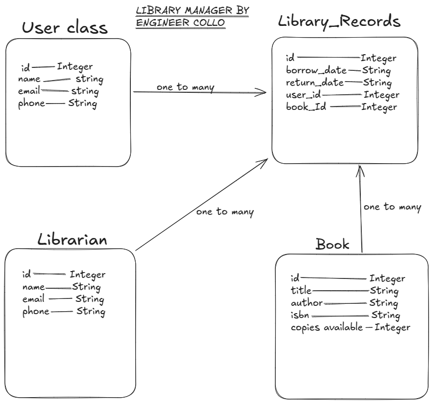

                                   LIBRARY APPLICATION

# Introduction.
This is a project that deals with managing library. it keeps track of all the books available in a library. it also keep a record of all the available librarians and all their contacts. all the members who uses the library are all recorded and every single record of the borrowed book is recorded together with the day the book was borrowed. 

# Project preparations.
Go to github, create an empty repository then clone it to the local project repository then inside that project repository run pipenv install and then pipenv shell to activate a new shell. in the same directory make python file with extension py,
    model.py - to handle models
    drop.py - to handle deleting database data
    cli.py - for displaying the menu that runs the application
    sedd.py - for seeding the database with required data
Then in the same project directory run pipenv install sqlalchemy this will instal sqlalchemy that is essential in application set ups. also in the same directory run pipeniv install alembic this alembic will really assist when we need to do some migrations in our application

Draw the sketch (Domain model) of lirary that will represent classes their attributes and the relationships between those classes.

